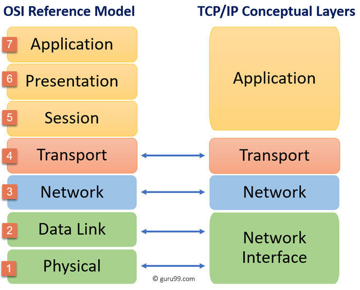

# Pytanie 4 - Model warstwowy TCP/IP

## Kuba

Model TCP/IP to zestaw protokołów komunikacyjnych, który stanowi fundament dzisiejszego Internetu. Został opracowany w latach 70. (agencja DARPA) jako otwarta architektura, co oznacza, że jest wolny od patentów i może być implementowany na dowolnym sprzęcie.

### Architektura modelu TCP/IP

Model ten dzieli funkcje sieciowe na 4 niezależne warstwy. Każda warstwa korzysta z usług warstwy niższej, nie musząc wiedzieć, jak jest ona zaimplementowana.

#### Warstwa 4: Aplikacji

Umożliwia użytkownikowi i oprogramowaniu dostęp do usług sieciowych.

Zadanie: **Obsługa konkretnych usług** (poczta, strony www, pliki).

Protokoły:

- **HTTP/HTTPS**: Przeglądanie stron internetowych.
- **DNS**: Tłumaczenie nazw (np. google.pl) na adresy IP.
- **SMTP/IMAP**: Obsługa poczty elektronicznej.
- **SSH/FTP**: Zdalna praca i przesyłanie plików.

#### Warstwa 3: Transportowa

Zapewnia komunikację między aplikacjami na dwóch różnych urządzeniach.

Zadanie: **Dzielenie danych na segmenty**, kontrola przepływu i adresowanie procesów za pomocą portów.

Protokoły: **TCP** (niezawodny) oraz **UDP** (szybki).

#### Warstwa 2: Internetu

Odpowiada za adresowanie logiczne i wybór drogi przesyłu danych.

Zadanie: **Adresowanie pakietów** (IP) oraz routing (wyznaczanie trasy przez routery).

Jednostka: Pakiet.

Protokoły:

- **IP** (IPv4/IPv6): Główny protokół adresowania.
- **ICMP**: Narzędzia diagnostyczne (np. polecenie ping).

#### Warstwa 1: Dostępu do sieci

Najniższa warstwa zajmująca się fizycznym przesyłem bitów.

Zadanie: **Zamiana danych na sygnały elektryczne/radiowe** i transmisja wewnątrz lokalnej sieci.

Protokoły: **Ethernet**, **Wi-Fi**.

Adresowanie: Wykorzystuje fizyczne adresy **MAC**.

---

### Porównanie: TCP vs UDP

W warstwie transportowej kluczowy jest wybór między niezawodnością a szybkością.

| Cecha                | TCP (Transmission Control Protocol)       | UDP (User Datagram Protocol)                  |
| -------------------- | ----------------------------------------- | --------------------------------------------- |
| **Tryb pracy**       | Połączeniowy (wymaga nawiązania sesji)    | Bezpołączeniowy (wysyła i zapomina)           |
| **Niezawodność**     | TAK (potwierdzenia odbioru, retransmisja) | NIE (brak gwarancji dostarczenia)             |
| **Kolejność danych** | Gwarantowana (składa dane w całość)       | Brak gwarancji (dane mogą dotrzeć pomieszane) |
| **Szybkość**         | Wolniejszy (duży narzut kontrolny)        | Bardzo szybki (minimalny narzut)              |
| **Zastosowanie**     | WWW, E-mail, Przesyłanie plików           | Streaming wideo, Gry online, VoIP, DNS        |

---

### Model TCP/IP a ISO/OSI

Model ISO/OSI (7 warstw) jest wzorcem teoretycznym, podczas gdy TCP/IP (4 warstwy) jest modelem praktycznym stosowanym w sieciach.

| Model TCP/IP         | Model ISO/OSI                 | Opis mapowania                                                          |
| -------------------- | ----------------------------- | ----------------------------------------------------------------------- |
| **Aplikacji**        | Aplikacji, Prezentacji, Sesji | TCP/IP łączy obsługę interfejsu, szyfrowanie i sesję w jednej warstwie. |
| **Transportowa**     | Transportowa                  | Identyczne funkcje (kanały komunikacyjne).                              |
| **Internetu**        | Sieciowa                      | Routing i pakiety IP.                                                   |
| **Dostępu do sieci** | Łącza danych, Fizyczna        | Obsługa ramek, kabli i sygnałów fizycznych.                             |

### Podsumowanie na obronie

Najważniejszą cechą modelu warstwowego jest **niezależność warstw**. Dzięki niej aplikacja (np. przeglądarka) nie musi wiedzieć, czy internet jest dostarczany kablem światłowodowym, czy przez Wi-Fi – warstwa aplikacji widzi tylko koniec kanału komunikacyjnego.

- **Enkapsulacja**: To proces pakowania danych z wyższej warstwy w "kopertę" warstwy niższej (dodawanie nagłówków).
- **Dekapsulacja**: Proces odwrotny u odbiorcy – zdejmowanie kolejnych nagłówków aż do uzyskania czystej informacji dla aplikacji.

---

---

## Stachu

### Warstwa dostępu do sieci (warstwa fizyczna)

Warstwa dostępu do sieci lub warstwa fizyczna (ang. network access layer) jest najniższą warstwą i to ona zajmuje się przekazywaniem danych przez fizyczne połączenia między urządzeniami sieciowymi. Najczęściej są to karty sieciowe lub modemy. Dodatkowo warstwa ta jest czasami wyposażona w protokoły do dynamicznego określania adresów IP.

### Warstwa internetowa (sieciowa)

Warstwa Internetu lub warstwa protokołu internetowego (ang. internet protocol layer) to sedno działania Internetu. W tej warstwie przetwarzane są datagramy posiadające adresy IP. Ustalana jest odpowiednia droga do docelowego komputera w sieci. Niektóre urządzenia sieciowe posiadają tę warstwę jako najwyższą. Są to routery, które zajmują się kierowaniem ruchu w Internecie, bo znają topologię sieci. Proces odnajdywania przez routery właściwej drogi określa się jako trasowanie.

### Warstwa transportowa

Warstwa transportowa (ang. host-to-host layer) gwarantuje pewność przesyłania danych oraz kieruje właściwe informacje do odpowiednich aplikacji. Opiera się to na wykorzystaniu portów określonych dla każdego połączenia. W jednym komputerze może istnieć wiele aplikacji wymieniających dane z tym samym komputerem w sieci i nie nastąpi wymieszanie się przesyłanych przez nie danych. To właśnie ta warstwa nawiązuje i zrywa połączenia między komputerami oraz zapewnia pewność transmisji i przesyłu danych.

### Warstwa aplikacji

Warstwa procesowa czy warstwa aplikacji (ang. process layer) to najwyższy poziom, w którym pracują użyteczne dla człowieka aplikacje, takie jak np. serwer WWW czy przeglądarka internetowa. Obejmuje ona zestaw gotowych protokoły, które aplikacje wykorzystują do przesyłania różnego typu informacji w sieci. Wykorzystywane protokoły to m.in.: HTTP, Telnet, FTP, TFTP, SNMP, DNS, SMTP, X Window.
