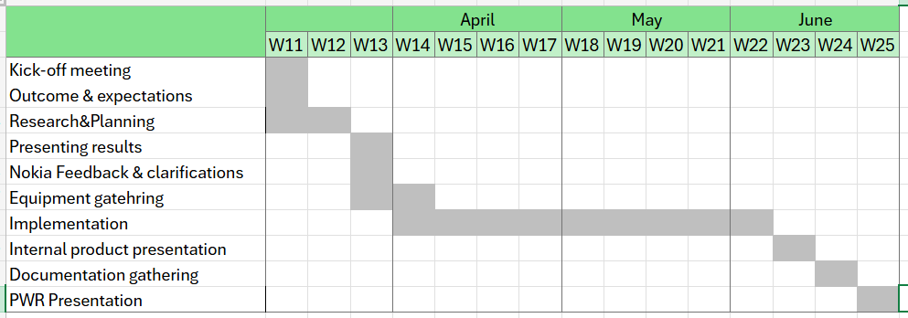
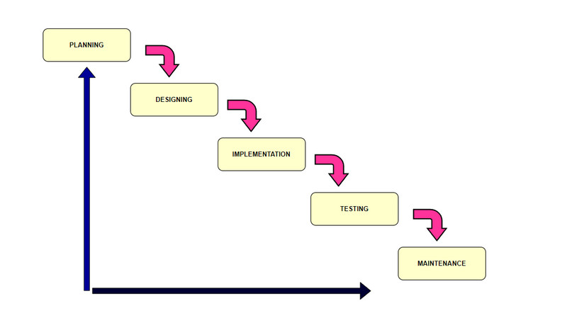
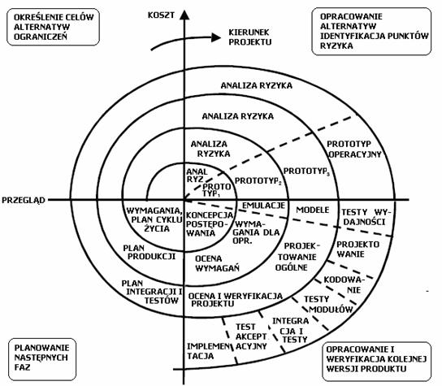
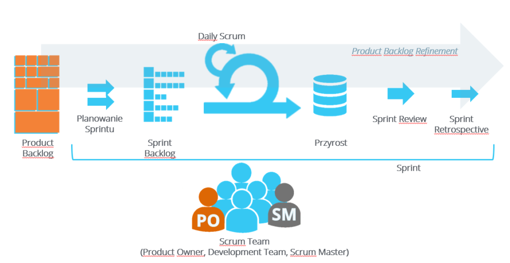

# Pytanie 13. Metody tworzenia harmonogramów w projekcie informatycznym

## Kuba

Zarządzanie projektem informatycznym wymaga precyzyjnego planowania etapów, zasobów oraz czasu realizacji. Wybór odpowiedniej metodyki zależy od specyfiki projektu, wymagań klienta oraz budżetu.

Proces ustalania ram czasowych dla poszczególnych zadań w projekcie, przypisywania do nich zasobów oraz określania zależności między nimi. Harmonogram jest kluczowym narzędziem kontroli postępów prac, pozwalającym monitorować, czy projekt zmierza do ukończenia w założonym terminie i budżecie.

**Podstawą stworzenia dobrego harmonogramu jest najpierw dekompozycja projektu, a następnie ułożenie zadań w czasie.**

### WBS (Work Breakdown Structure) / SPP (Struktura Podziału Pracy)

Zanim powstanie harmonogram czasowy, musi powstać WBS. Jest to hierarchiczny podział projektu na mniejsze, zarządzalne elementy (pakiety prac).

**Cel:** Zdefiniowanie "co jest do zrobienia". Nie pokazuje "kiedy", ale stanowi fundament dla wszystkich innych metod harmonogramowania.

**Zasada:** Podział trwa do momentu, gdy zadania są na tyle małe, by można je łatwo wycenić czasowo i przypisać do konkretnej osoby.

### Wykres Gantta

Najpopularniejsza wizualna metoda harmonogramowania. To podstawowe narzędzie graficzne służące do planowania i kontroli przebiegu prac. Przedstawia on zadania w czasie, uwzględniając ich następczość oraz relacje (zadania wykonywane szeregowo i równolegle).

**Opis:**

- Poziomy wykres słupkowy
- Oś pozioma reprezentuje czas
- Oś pionowa listę zadań
- Długość słupka odpowiada czasowi trwania zadania

**Zastosowanie:**

- Wizualizacja postępu prac
- Nakładanie się zadań w czasie
- Pokazywanie prostych zależności (np. zadanie B zaczyna się po zadaniu A)

**Cel:** Wspomaganie kierownika projektu poprzez wizualizację powiązań między zadaniami oraz wpływu opóźnień na końcowy termin.

**Elementy:** Kamienie milowe (punkty kontrolne), zadania krytyczne (których opóźnienie przesuwa koniec projektu) oraz zadania niekrytyczne.

**Zastosowanie:** Pozwala na optymalizację planu i przeprowadzanie symulacji zmian w zasobach.

> Opis zdjęcia: Wykres przedstawiający listę zadań po lewej stronie i przedziały czasowe przewidziane na ich realizację. Powinien zawierać strzałki zależności między zadaniami oraz zaznaczone kamienie milowe w kształcie rombów (Co jak widać nie zawsze jest tak implementowane).

### Model Kaskadowy (Waterfall)

Najstarsza, klasyczna metoda, w której projekt jest dzielony na fazy następujące kolejno po sobie. Wyjście z jednej fazy stanowi wejście do kolejnej.

Fazy: Analiza wymagań $\rightarrow$ Projektowanie $\rightarrow$ Implementacja $\rightarrow$ Testowanie $\rightarrow$ Wdrożenie $\rightarrow$ Utrzymanie.

Zalety: Świetna dokumentacja, łatwość monitorowania postępów, jasne korzyści dla klienta na etapie planowania.

Wady: Brak elastyczności (trudno wrócić do poprzedniej fazy), wysokie koszty błędów wykrytych późno, system testowany dopiero na samym końcu.

> Opis zdjęcia: Diagram schodkowy, gdzie każda faza "spływa" do następnej niczym kaskada wodna.

### Model Spiralny

Rozwinięcie modelu kaskadowego o podejście iteracyjne. Stosowany w dużych, skomplikowanych i kosztownych systemach, gdzie ryzyko jest wysokie.

Zasada działania: Projekt przechodzi przez te same fazy wielokrotnie w kolejnych pętlach (iteracjach), za każdym razem dostarczając coraz bardziej zaawansowany prototyp.

Zalety: Ciągła współpraca z klientem, wczesna identyfikacja braków w wymaganiach.

Wady: Wymaga ogromnej dyscypliny ze strony klienta, trudna kontrola budżetu i harmonogramu przy dużej liczbie pętli.

> Opis zdjęcia: Spirala podzielona na ćwiartki: ustalanie celów, ocena ryzyka, tworzenie (inżynieria) oraz planowanie kolejnej fazy.

### Metodyka SCRUM

Scrum to nowoczesna, adaptacyjna metoda zarządzania (Agile). Zamiast planować cały projekt od razu, pracuje się w krótkich cyklach zwanych Sprintami (przebiegami).

**Role w SCRUM:**

Właściciel produktu (Product Owner): Reprezentuje klienta, decyduje o priorytetach biznesowych.

Scrum Master: Strażnik procesu, usuwa przeszkody stojące przed zespołem.

Zespół deweloperski: Specjaliści realizujący zadania (programiści, testerzy).

Interesariusze: Osoby obserwujące postępy, wpływające na strategię.

**Proces:**

Sprint: Okres od 2 do 6 tygodni, po którym musi powstać działający przyrost produktu.

User Stories (Historyjki): Opis wymagań z punktu widzenia użytkownika.

Product Backlog: Pełna lista wymagań do zrealizowania w projekcie.

Sprint Backlog: Lista zadań wybrana do realizacji w bieżącym Sprincie.

> Opis zdjęcia: Diagram procesu Scrum ilustrujący cykl Sprintu, kluczowe artefakty (Backlogi, Przyrost) oraz wydarzenia (Planowanie, Daily Scrum, Review, Retrospektywa).

### CPM (Critical Path Method) – Metoda Ścieżki Krytycznej

Deterministyczna metoda planowania, skupiająca się na zależnościach między zadaniami.

**Ścieżka krytyczna:** To ciąg zadań, których suma czasów trwania jest najdłuższa w całym projekcie. Wyznacza ona **najkrótszy możliwy czas realizacji całego przedsięwzięcia**.

**Kluczowa cecha:**

- Zadania na ścieżce krytycznej mają **zerowy zapas czasu (luz)**
- Jakiekolwiek opóźnienie na ścieżce krytycznej opóźnia termin zakończenia całego projektu

### PERT (Program Evaluation and Review Technique)

Metoda zbliżona do CPM, ale **uwzględniająca niepewność** (metoda probabilistyczna). Stosowana w nowatorskich projektach, gdzie trudno precyzyjnie oszacować czas.

**Szacowanie czasu:** Zamiast jednej wartości, dla każdego zadania podaje się trzy:

- **Czas optymistyczny (O)**
- **Czas najbardziej prawdopodobny (M)**
- **Czas pesymistyczny (P)**

**Wzór:** Czas oczekiwany oblicza się jako średnią ważoną:

$$TE = \frac{O + 4M + P}{6}$$

### Podejście Zwinne (Agile / Scrum)

W projektach informatycznych odchodzi się od sztywnego planowania całego projektu z góry (Waterfall) na rzecz **planowania iteracyjnego**.

**Planowanie Sprintu (Sprint Planning):**

- Zespół wybiera zadania z Rejestru Produktu (Product Backlog)
- Realizacja w krótkim cyklu (np. 2 tygodnie)

**Estymacja:**

- Zamiast godzin, często używa się jednostek abstrakcyjnych (Story Points)
- Planning Poker pozwala ocenić złożoność zadania, a nie dokładny czas

**Harmonogram:**

- Dynamiczny
- Szczegółowy plan istnieje tylko na najbliższy sprint
- Reszta jest planowana zgrubnie (Roadmapa)

### Podsumowanie na obronie

- ✅ **Definicja harmonogramowania** (zarządzanie czasem i zasobami)
- ✅ **WBS (SPP):** Hierarchiczny podział prac (fundament)
- ✅ **Wykres Gantta:** Wizualizacja zadań na osi czasu, kamienie milowe, zadania krytyczne
- ✅ **Model Kaskadowy (Waterfall):** Fazy sekwencyjne, dokumentacja, brak elastyczności
- ✅ **Model Spiralny:** Iteracyjne podejście z oceną ryzyka, prototypy
- ✅ **SCRUM:** Role (Product Owner, Scrum Master), sprinty, backlogi, user stories
- ✅ **CPM** (Ścieżka Krytyczna): Najdłuższa ścieżka zadań zależnych, brak zapasu czasu, determinuje koniec projektu
- ✅ **PERT:** Metoda probabilistyczna (3 czasy: optymistyczny, realny, pesymistyczny)
- ✅ **Metody Agilowe:** Planowanie iteracyjne (sprinty), estymacja w Story Points

Podczas odpowiedzi warto podkreślić, że Wykres Gantta to narzędzie uniwersalne, które można stosować zarówno w modelu kaskadowym, jak i pomocniczo w innych. Kluczową różnicą między metodami jest podejście do zmian: Waterfall zakłada sztywność, podczas gdy SCRUM stawia na elastyczność i ciągłe dostarczanie wartościowych fragmentów kodu.

### Kanban

Metoda wizualizacji przepływu pracy (workflow), wywodząca się z systemu produkcyjnego Toyoty.

**Tablica Kanban:** Dzieli zadania na kolumny (np. Do zrobienia, W trakcie, Gotowe).

**WIP Limit:** Ograniczenie liczby zadań "w trakcie", co zapobiega wąskim gardłom.

**Charakter:** W przeciwieństwie do Scruma, Kanban jest procesem ciągłym, bez sztywnych ram czasowych (sprintów).

### Symulacje Monte Carlo

Wykorzystywane w zaawansowanym zarządzaniu ryzykiem.

Polegają na tysiąckrotnym powtórzeniu symulacji projektu przy użyciu losowych wartości czasu trwania zadań (z określonego zakresu).

**Wynik:** Rozkład prawdopodobieństwa zakończenia projektu w danym terminie.

### Harmonogramowanie w Metodykach Zwinnych (Scrum)

W Agile planowanie jest iteracyjne, a nie jednorazowe.

**Rejestr Produktu (Backlog):** Dynamiczna lista wszystkich wymagań.

**Planowanie Sprintu:** Zespół planuje prace tylko na krótki okres (2-4 tygodnie).

**Estymacja:** Często używa się jednostek abstrakcyjnych (Story Points) zamiast godzin.

**Prędkość zespołu (Velocity):** Średnia liczba punktów realizowanych w sprincie, pozwalająca przewidywać termin końcowy całego projektu na podstawie Roadmapy.

### Podsumowanie dla egzaminatora

Harmonogramowanie to balans między teorią (metody sieciowe jak CPM/PERT) a praktyką wizualną (Gantt, Kanban). Kluczowe jest zrozumienie ścieżki krytycznej, ponieważ to ona determinuje ryzyko opóźnienia całego przedsięwzięcia. W nowoczesnych projektach IT odchodzi się od sztywnego planowania z góry na rzecz podejścia zwinnego, gdzie szczegółowy harmonogram istnieje tylko dla najbliższej iteracji.

## Stachu

- **Wykres Gantta**
- **Ścieżka krytyczna CPM**
  Technika wykorzystująca diagramy do organizowania harmonogramów. Przy jej pomocy można stworzyć harmonogram projektu oparty na najdłuższej ścieżce, reprezentującej maksymalny czas wykonania wszystkich czynności
  _ ES – Early start (lub WS – wczesny start)
  Jest to numer dnia, w którym zaczynamy wykonywanie danego zadania przy planowaniu „w przód”; dla danego zadania ES=EF zadania poprzedniego.
  _ EF – Early finish (lub WK – wczesny koniec)
  Jest to numer dnia, w którym kończymy wykonywanie danego zadania przy planowaniu „w przód”; dla danego zadania EF=ES zadania następnego.
  _ LS – Late start (lub PS – późny start)
  Jest to numer dnia, w którym zaczynamy wykonywanie danego zadania przy planowaniu „wstecz”; dla danego zadania LS=LF zadania następnego (skoro planujemy „wstecz” więc zadanie następne oznacza chronologicznie wcześniejsze).
  _ LF – Late finish (lub PK – późny koniec)
  Jest to numer dnia, w którym kończymy wykonywanie danego zadania przy planowaniu „wstecz”; dla danego zadania LF=LS zadania poprzedniego (skoro planujemy „wstecz”, poprzedni oznacza późniejszy chronologicznie).

- **PERT**
  Technika diagramów sieci czynności opisanych za pomocą łuków, oznaczających oczekiwany czas trwania czynności oraz technika estymacji oczekiwanego czasu realizacji projektu.
  PERT to metoda analizy zadań związanych z realizacją projektu, w szczególności czasu potrzebnego na wykonanie każdego zadania oraz określenia minimalnego czasu potrzebnego do ukończenia całego projektu. Uwzględnia niepewność, umożliwiając zaplanowanie projektu, nie znając dokładnie szczegółów i czasu trwania wszystkich działań. Jest bardziej zorientowany na wydarzenia niż na rozpoczęcie i ukończenie, i jest stosowany raczej w projektach, w których czas jest głównym ograniczeniem, a nie koszt. Jest on stosowany do bardzo dużych, jednorazowych, złożonych, nierutynowych projektów infrastrukturalnych, a także projektów badawczo-rozwojowych.
- **Metoda Zwinna (kanban, scrum)**
- **Monte Carlo (gambling [symulacje])**
