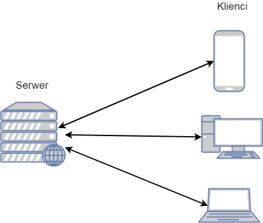
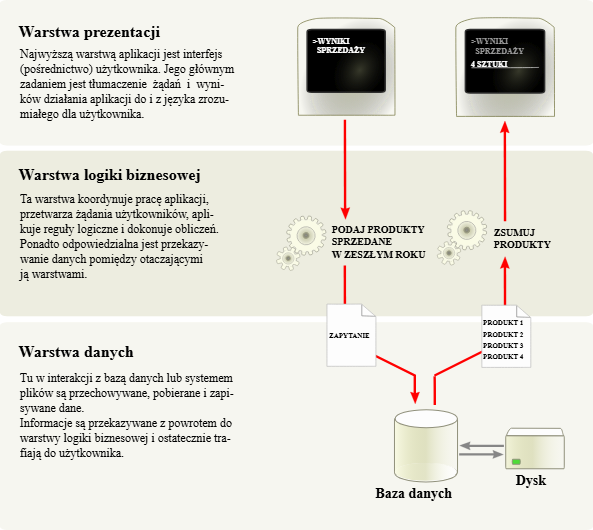
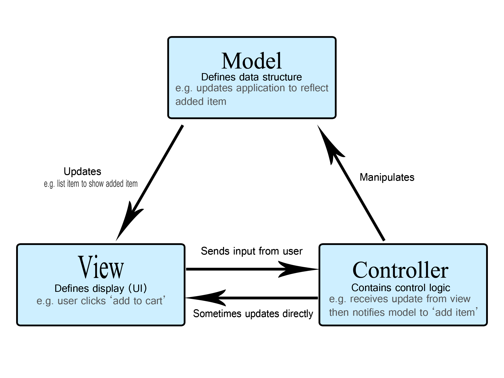

# Pytanie 16. Architektura warstwowa w internetowych aplikacjach bazodanowych

## Kuba

Architektura warstwowa (n-tier architecture) to model organizacji oprogramowania, w którym system jest podzielony na logiczne warstwy. Każda warstwa pełni określoną rolę i komunikuje się z warstwami sąsiednimi za pomocą ustalonych protokołów.

Sposób projektowania systemów informatycznych polegający na logicznym (a często też fizycznym) podziale aplikacji na odseparowane od siebie warstwy. **Każda warstwa ma ściśle określoną odpowiedzialność i komunikuje się tylko z warstwami sąsiednimi.**

### Rodzaje architektur warstwowych

#### A. Architektura jednowarstwowa (1-tier)

Całe oprogramowanie (interfejs, logika i dane) znajduje się w jednym pakiecie na jednym komputerze.

**Przykład:** Proste, klasyczne aplikacje desktopowe (np. kalkulator, edytor tekstu bez funkcji chmury).

#### B. Architektura dwuwarstwowa (2-tier / Klient-Serwer)

Oprogramowanie jest podzielone na dwie główne części:

- **Klient:** Odpowiada za interfejs użytkownika (UI).
- **Serwer:** Posiada dostęp do bazy danych (RDBMS) i ewentualnie wykonuje prostą logikę.

**Komunikacja:** Odbywa się przez standardowe protokoły (np. HTTP, SMTP, FTP) lub dedykowane rozwiązania.

**Przykład:** Strona WWW, gdzie przeglądarka jest klientem, a serwer WWW/bazodanowy dostarcza treści.

> Opis zdjęcia: Schemat pokazujący wiele urządzeń klienckich (laptop, telefon) połączonych strzałkami z jednym centralnym serwerem bazy danych.

#### C. Architektura trójwarstwowa (3-tier)

To obecnie najpopularniejszy model dla aplikacji internetowych. Dzieli system na trzy niezależne poziomy:

- **Warstwa prezentacji (Presentation Tier):** Odpowiada za interakcję z użytkownikiem. Wyświetla dane i odbiera polecenia. Technologie: Przeglądarki internetowe, HTML/CSS/JavaScript, aplikacje mobilne.
- **Warstwa biznesowa / Logiki (Business/Application Tier):** "Mózg" aplikacji. Przetwarza żądania użytkownika, wykonuje obliczenia i podejmuje decyzje logiczne. Służy jako pomost między UI a danymi. Technologie: Serwery aplikacji (Java, Python, PHP, .NET).
- **Warstwa danych (Data/Persistence Tier):** Odpowiada za bezpieczne przechowywanie i dostarczanie danych. Technologie: Bazy danych (SQL, NoSQL), systemy plików.

> Opis zdjęcia: Trzy bloki ustawione jeden nad drugim: na górze "Prezentacja", w środku "Logika biznesowa", na dole "Dane". Między blokami widoczne strzałki przepływu informacji.

### Główne warstwy w architekturze trójwarstwowej

#### Warstwa Prezentacji (Presentation Layer)

**Co to jest:** To, co widzi użytkownik (interfejs graficzny - GUI). W aplikacjach webowych jest to przeglądarka wyświetlająca HTML, CSS i JavaScript.

**Zadanie:**

- Wyświetlanie danych użytkownikowi
- Odbieranie od niego poleceń (kliknięcia, formularze)
- Przekazywanie poleceń do warstwy niższej
- Nie powinna zawierać skomplikowanej logiki biznesowej

#### Warstwa Logiki Biznesowej (Business Logic Layer / Application Layer)

**Co to jest:** **"Mózg" aplikacji**, znajdujący się na serwerze (np. kod w Java, C#, Python, PHP).

**Zadanie:**

- Przetwarzanie danych
- Podejmowanie decyzji
- Wykonywanie obliczeń
- Walidacje (np. "czy użytkownik ma wystarczająco środków na koncie")
- Sterowanie przepływem informacji między prezentacją a bazą danych

#### Warstwa Danych (Data Access Layer)

**Co to jest:** Baza danych (np. SQL Server, MySQL) oraz mechanizmy dostępu do niej.

**Zadanie:**

- Trwałe przechowywanie informacji
- Udostępnianie danych
- Warstwa ta nie wie nic o tym, jak dane będą wyświetlane – ona tylko "składuje" i "wydaje"

### Wzorzec MVC (Jako realizacja architektury)

Wewnątrz aplikacji internetowych (głównie w warstwie logiki i prezentacji) najczęściej stosuje się **wzorzec MVC (Model-View-Controller)**, który porządkuje kod:

#### Model (Model)

- Reprezentuje dane i logikę biznesową (np. klasa Użytkownik z polami login i hasło)
- Odpowiada za dostęp do bazy danych

#### Widok (View)

- Odpowiada za prezentację danych (np. plik HTML generujący tabelkę z użytkownikami)
- Nie zajmuje się logiką

#### Kontroler (Controller)

- Pośrednik
- Odbiera żądanie od użytkownika
- Decyduje co z nim zrobić (uruchamia logikę z Modelu)
- Wybiera odpowiedni Widok do wyświetlenia wyniku

> Opis zdjęcia: Schemat wzorca MVC pokazujący interakcje między Modelem (dane), Widokiem (interfejs) i Kontrolerem (logika sterowania).

### Zalety architektury warstwowej

Podział systemu na niezależne warstwy niesie za sobą ogromne korzyści projektowe i biznesowe:

- **Niezależność komponentów:** Można zmienić technologię w jednej warstwie (np. wymienić bazę danych z MySQL na PostgreSQL) bez konieczności przepisywania warstwy prezentacji.
- **Skalowalność:** Jeśli aplikacja ma wielu użytkowników, możemy dołożyć więcej serwerów do warstwy biznesowej, nie ruszając warstwy danych.
- **Łatwość zarządzania:** Każdy zespół programistów może pracować nad inną warstwą (front-end vs back-end).
- **Bezpieczeństwo:** Warstwa prezentacji nie ma bezpośredniego dostępu do bazy danych. Musi "poprosić" o dane warstwę logiki, która sprawdza uprawnienia.
- **Ponowne użycie kodu:** Ta sama logika biznesowa może obsługiwać różne interfejsy (np. stronę www i aplikację mobilną).

#### Separacja odpowiedzialności

Zmiana wyglądu przycisku w HTML (Warstwa Prezentacji) nie wymaga zmiany kodu obliczającego podatek (Logika Biznesowa).

#### Niezależność

Możemy zmienić bazę danych z MySQL na PostgreSQL zmieniając tylko Warstwę Danych, bez przepisywania całej aplikacji.

#### Bezpieczeństwo

Użytkownik nie ma bezpośredniego dostępu do bazy danych – musi przejść przez warstwę logiki, która go zweryfikuje.

### Przykłady aplikacji

- **E-commerce (np. Allegro):** 3-tier – frontend (strona), backend (logika zamówień), baza (produkty, użytkownicy).
- **Bankowość online:** 3-tier z dodatkowymi warstwami bezpieczeństwa.
- **Media społecznościowe (np. Facebook):** Mikroserwisy rozszerzające 3-tier.

### Porównanie z mikroserwisami

- **Warstwy:** Monolityczna struktura.
- **Mikroserwisy:** Każda warstwa może być podzielona na niezależne usługi (np. osobny serwis dla płatności).

### Technologie

- **Frontend:** React, Angular, Vue.js.
- **Backend:** Node.js, Django, Spring.
- **Bazy:** MySQL, MongoDB.

### Podsumowanie na obronie

- ✅ **Definicja:** Podział na warstwy z separacją odpowiedzialności.
- ✅ **Rodzaje:** 1-tier (proste), 2-tier (klient-serwer), 3-tier (prezentacja-logika-dane).
- ✅ **Warstwy 3-tier:** Prezentacja (UI), Logika (obliczenia), Dane (baza).
- ✅ **MVC:** Model (dane), View (wygląd), Controller (sterowanie).
- ✅ **Zalety:** Niezależność, skalowalność, bezpieczeństwo.
- ✅ **Przykłady:** E-commerce, bankowość.

Architektura warstwowa to standard w budowaniu systemów internetowych. Pozwala na tworzenie aplikacji, które są elastyczne i bezpieczne. Najważniejszą myślą jest to, że każda warstwa zajmuje się tylko swoim zadaniem (separacja obaw – Separation of Concerns), co drastycznie ułatwia utrzymanie systemu w długim terminie.

## Stachu

Frontend (warstwa prezentacji), Backend (warstwa biznesowa, logiczna) i Baza Danych (warstwa dostępu do danych), ez
